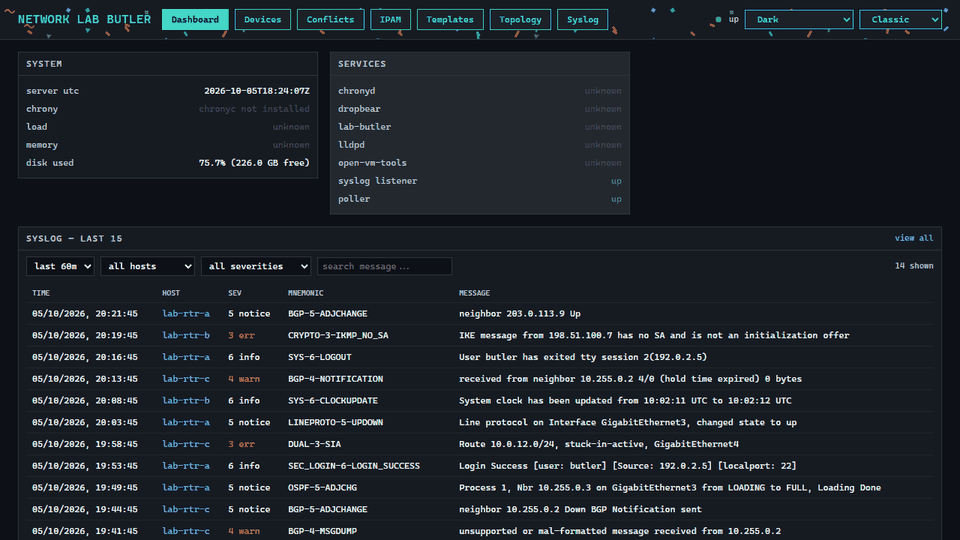
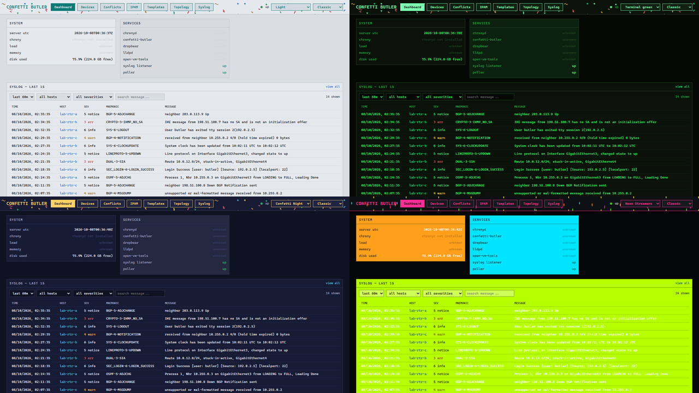
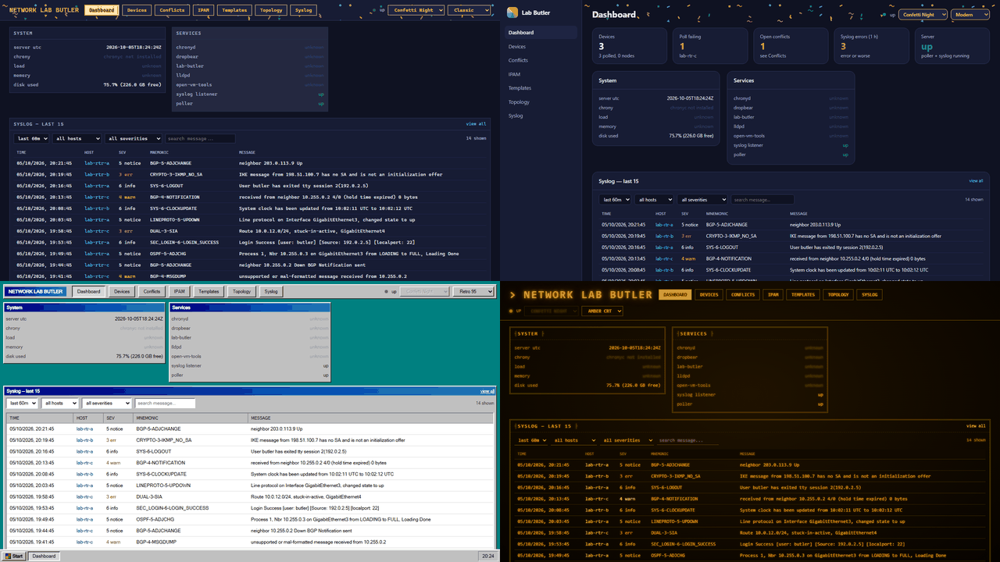

# confetti-butler

> **AI disclaimer:** This project was created using [Claude Code](https://claude.com/claude-code).

A companion server for the routers in a network lab. It polls each router over SSH (read-only
`show` commands) and shows what is in use right now: interfaces and addresses (IPAM), LLDP
neighbors and BGP/OSPF peers drawn as a topology graph, and syslog. It also renders config
templates that a router pulls for itself. confetti-butler never writes to a device.



*Mock data from a made-up lab, using documentation-range addresses. See
[Running locally](#running-locally).*

## Themes and layouts

The look follows the hub UI of the sibling project
[confetti-traffic](https://github.com/orneh24/confetti-traffic). Both pickers are in the header
and the choice is saved in your browser.





- **Themes:** Dark, Light, Monokai, High Contrast, Terminal green, Confetti Night and
  Neon Streamers. **Shuffle** switches between them at random every 5-10 minutes, and picks a random layout each time.
- **Layouts:** Classic, Modern (side menu and summary tiles on the dashboard), Retro 95,
  Amber CRT and Neon Green CRT. Retro 95 and the CRT layouts bring their own colours, so the theme picker is
  disabled while one is on.

## What it does

- **Devices.** Add routers by hand, by a subnet sweep (SSH port scan), from a YAML seed file, or
  import the test nodes from [confetti-traffic](https://github.com/orneh24/confetti-traffic). The same router seen by two sources lands
  on one device. When the identifiers disagree (the same IP now answers with a different serial),
  confetti-butler raises a conflict instead of guessing.
- **Polling.** Every few minutes it logs in once per router and reads version, interfaces, LLDP,
  BGP and OSPF. Anything a router stops reporting drops out of the app.
- **IPAM.** Addresses come from the routers' own interfaces. It flags subnets that partly overlap
  and IPs assigned twice.
- **Topology.** LLDP links and BGP/OSPF adjacencies on one graph, with a filter per protocol.
  A neighbor that isn't a known device shows as a dashed "ghost" node.
- **Config templates.** Jinja2 templates rendered against a router's polled facts and your
  per-device variables. The preview warns about dangerous or insecure lines. A router fetches
  its config itself:
  `copy http://<butler>/configs/<device-key>.cfg running-config`.
- **Syslog.** A UDP receiver, with each message linked to the device that sent it.
- **Look.** Seven colour themes (or Shuffle) and five layouts. See [Themes and layouts](#themes-and-layouts).

Built for Cisco IOS / IOS-XE, and tested against CSR1000v routers on IOS-XE 17.3 and 3.11.

## Running locally

Needs Python 3 and `pip install -r butler/requirements.txt`. Ports 80 and 514 need admin rights,
so pick others:

```sh
cd butler
BUTLER_PORT=8080 BUTLER_SYSLOG_PORT=5514 python serve.py
```

Open http://localhost:8080 and add a device on the Devices page. Set its SSH login on the device
page (Credentials), then click **Poll now**. The database is `butler.db` in the working folder.

## Deploying

`butler/build-template.sh` builds an Alpine Linux VM template (OpenRC service, waitress, port 80),
following the same pattern as confetti-traffic's hub. **It has not yet been run on a real Alpine VM.**
vCenter discovery is also not yet tested against a real vCenter.

## Security notes

- Credentials are stored in plain text in `butler.db`. Keep the file private; it is gitignored.
- The web UI and API have no login. Run it on a lab network only.
- `/configs/*.cfg` is unauthenticated by design, because a router can't log in to fetch it.
  Keep secrets out of templates and use `{{ vars.* }}` instead. confetti-butler warns when a
  template contains a literal secret.

## More

- [`CLAUDE.md`](CLAUDE.md): architecture and the rules not to break
- [`docs/HANDOFF.md`](docs/HANDOFF.md): build history, and what is and isn't verified
